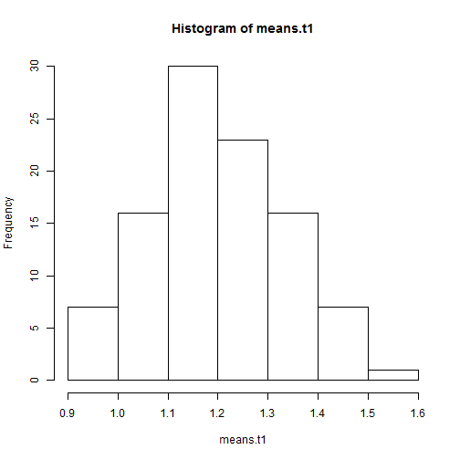
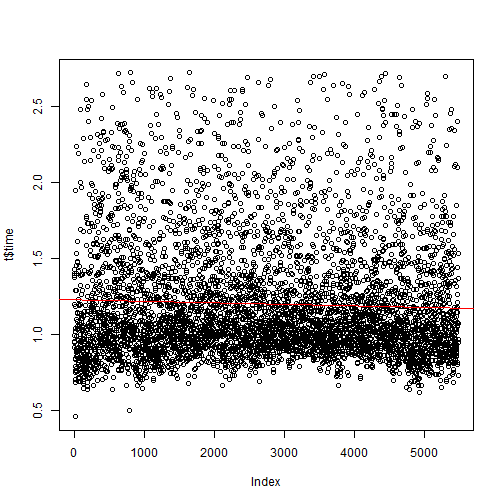

Reaction Time analysis
========================================================


## analysis after outliers filtering

```r
hist(means.t)
```

 

```r
boxplot(means.t)
stripchart(means.t, vertical = TRUE, method = "jitter", pch = 21, col = "maroon", 
    bg = "bisque", add = TRUE)
```

 

```r
sort(means.t)
```

```
##     00     14     33     55     19     37     35     56     12     05 
## 0.9040 0.9078 0.9173 0.9218 0.9282 0.9323 0.9425 0.9456 0.9481 0.9591 
##     88     59     25     69     09     50     36     85     53     04 
## 0.9881 0.9961 1.0135 1.0148 1.0168 1.0208 1.0269 1.0283 1.0380 1.0392 
##     54     49     17     31     64     45     28     44     65     79 
## 1.0405 1.0481 1.0526 1.0573 1.0593 1.0600 1.0623 1.0685 1.0801 1.0905 
##     11     77     29     06     26     41     22     95     24     60 
## 1.0926 1.0935 1.0965 1.0988 1.0994 1.1000 1.1002 1.1003 1.1071 1.1097 
##     48     34     98     10     91     94     07     18     32     47 
## 1.1147 1.1189 1.1210 1.1246 1.1297 1.1314 1.1336 1.1361 1.1371 1.1374 
##     20     96     21     08     42     01     61     75     86     13 
## 1.1399 1.1450 1.1519 1.1562 1.1610 1.1638 1.1654 1.1674 1.1674 1.1730 
##     78     76     97     03     15     73     72     81     16     57 
## 1.1749 1.1766 1.1813 1.1839 1.1862 1.1892 1.1924 1.1945 1.1954 1.1988 
##     74     27     66     82     71     80     39     92     93     23 
## 1.2034 1.2100 1.2101 1.2169 1.2173 1.2174 1.2179 1.2279 1.2320 1.2340 
##     43     46     67     58     89     02     38     87     51     90 
## 1.2381 1.2386 1.2399 1.2572 1.2577 1.2645 1.2795 1.2935 1.3016 1.3024 
##     40     30     99     62     83     70     68     84     52     63 
## 1.3027 1.3094 1.3300 1.3383 1.3429 1.3484 1.3598 1.3792 1.3877 1.4007
```


The unbiased mean reaction time across the last 1500 trials is evaluated at 

```

Error in eval(expr, envir, enclos) : objet 'mm' introuvable

```


## unbiased mean reaction time of the last 1000 items

The script which comes from the datas makes harder item more frequent

```r
time1000 <- tail(t$time, n = 1000)
item1000 <- tail(t$item, n = 1000)
means.time1000 = tapply(time1000, item1000, mean)
sort(means.time1000)
```

```
##     12     35     09     34     55     19     14     33     05     36 
## 0.7964 0.8113 0.8408 0.8514 0.8556 0.8575 0.8695 0.8752 0.9043 0.9121 
##     04     41     69     37     59     54     49     25     45     28 
## 0.9121 0.9341 0.9344 0.9383 0.9513 0.9658 0.9665 0.9694 0.9703 0.9724 
##     77     00     53     47     79     74     56     44     13     89 
## 0.9750 0.9758 0.9774 0.9861 0.9887 0.9894 0.9908 0.9966 1.0039 1.0081 
##     29     22     17     42     88     16     20     48     31     40 
## 1.0151 1.0154 1.0155 1.0195 1.0276 1.0286 1.0461 1.0536 1.0573 1.0621 
##     94     81     32     60     85     15     03     65     23     07 
## 1.0650 1.0654 1.0665 1.0684 1.0696 1.0772 1.0887 1.0890 1.0891 1.0893 
##     78     64     91     21     06     39     84     95     46     76 
## 1.1019 1.1020 1.1063 1.1083 1.1101 1.1146 1.1151 1.1156 1.1164 1.1177 
##     66     02     62     73     97     24     30     26     71     67 
## 1.1229 1.1373 1.1453 1.1532 1.1558 1.1602 1.1636 1.1687 1.1689 1.1704 
##     86     38     10     18     43     01     93     75     82     96 
## 1.1711 1.1727 1.1808 1.1821 1.1837 1.1911 1.1986 1.2014 1.2111 1.2114 
##     63     70     27     08     57     11     68     92     72     61 
## 1.2134 1.2143 1.2161 1.2235 1.2273 1.2299 1.2310 1.2391 1.2480 1.2490 
##     98     52     87     99     50     51     83     58     90     80 
## 1.2576 1.2695 1.3033 1.3181 1.3366 1.3415 1.3422 1.3527 1.3628 1.4027
```

```r
mm = mean(means.time1000)
```

The unbiased mean reaction time across the last 1000 trials is evaluated at 1.0923
# predictions based on the whole dataset
## plot

```r
t$ind <- seq.int(nrow(t))
plot(t$time)
linearModel = lm(t$time ~ t$ind)
abline(linearModel, col = "red")
```

 

## predict

```r
intercept = coef(linearModel)["(Intercept)"]
slope = coef(linearModel)["t$ind"]
nbTrials = round((1 - intercept)/slope - tail(t$ind, n = 1), -2)
```

each time an item is viewed, the mean reaction time diminish of -1.6523 &times; 10<sup>-5</sup>, not that much then :)   
At this rate 5700 new trials will be recquired to get a mean below 1s
# predictions based on the last 1000 trials
## plot

```r
tind2 <- tail(t$ind, n = 1000)
ttime2 <- tail(t$time, n = 1000)
plot(ttime2)
l5 = lm(ttime2 ~ tind2)
coef(l5)
```

```
## (Intercept)       tind2 
##  1.29603603 -0.00002357
```

```r
abline(l5, col = "blue")
```

 

## predict

```r
intercept = coef(linearModel)["(Intercept)"]
slope = coef(linearModel)["tind2"]
nbTrials = round((1 - intercept)/slope - tail(tind2, n = 1), -2)
days = round(((1 - intercept)/slope - tail(tind2, n = 1))/1000, 1)
```

each time an item is viewed, the mean reaction time diminish of NA.
At this rate NA new trials will be recquired to get a mean below 1s. With 1000 trials by day, it will need NA days. Maybe a more sharper training programm focused on weak element might allow a faster reach of the 1s threshold

# is the challenge to get below 1s after a week is completed ?
According the the other plots, it is not.
## more precise analysis : means for each item based on their 3 last reaction time.

```r
n = 3
means.tLast4 = tapply(t$time, t$item, function(i) mean(tail(i, n)))
sort(means.tLast4)
```

```
##     19     00     12     35     09     55     05     20     69     34 
## 0.7709 0.7999 0.8099 0.8255 0.8312 0.8338 0.8525 0.8584 0.8590 0.8669 
##     29     14     88     37     33     41     26     04     45     77 
## 0.8704 0.8829 0.8956 0.9089 0.9120 0.9134 0.9151 0.9236 0.9240 0.9287 
##     17     03     79     60     59     56     18     49     36     27 
## 0.9309 0.9326 0.9337 0.9339 0.9368 0.9368 0.9413 0.9513 0.9526 0.9536 
##     46     01     22     92     28     11     89     93     96     53 
## 0.9580 0.9642 0.9668 0.9697 0.9700 0.9701 0.9725 0.9771 0.9862 0.9951 
##     98     47     82     78     75     39     07     42     25     44 
## 0.9997 1.0029 1.0042 1.0072 1.0111 1.0164 1.0191 1.0195 1.0217 1.0229 
##     97     66     94     48     74     15     63     54     16     68 
## 1.0241 1.0261 1.0290 1.0293 1.0298 1.0343 1.0349 1.0359 1.0417 1.0463 
##     65     13     99     81     08     30     62     64     70     43 
## 1.0511 1.0523 1.0574 1.0587 1.0615 1.0635 1.0747 1.0757 1.0761 1.0764 
##     86     80     67     23     40     32     50     91     76     24 
## 1.0798 1.0916 1.1022 1.1076 1.1078 1.1081 1.1230 1.1326 1.1343 1.1357 
##     84     61     90     31     95     73     52     87     85     10 
## 1.1421 1.1468 1.1483 1.1517 1.1543 1.1570 1.2017 1.2093 1.2140 1.2277 
##     72     02     21     71     58     57     51     06     38     83 
## 1.2277 1.2431 1.2459 1.2617 1.2781 1.3431 1.3910 1.4036 1.4308 1.5393
```

```r
m = mean(means.tLast4)
m
```

```
## [1] 1.039
```

We got a mean equal to 1.0386 s. This slightly above the goal :(   
20 March : challenge (almost) not reached !

## Note to myself
Correlation analysis is a stupid way to predict how the mean is evolving. It's very clear that the real mean reaction time is below the line, the reason is that correlation analysis is based on mean squared error estimations, for this reasons, harder items weight much more than easy items (which have less discrepancy).   
Least mean square is suitable to predict individual points, but not suited for the means. 
All these predictive analysis should be replaced by linear regression over the unbiased mean reaction time instead of biased individual points (harder items are over represented)
