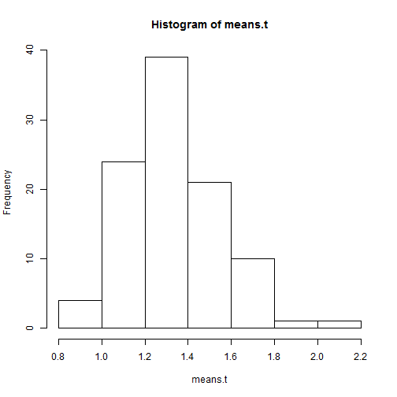
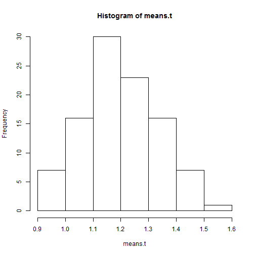
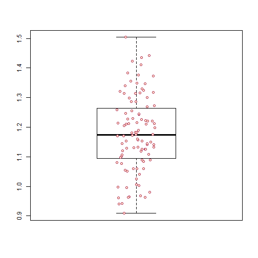

Reaction Time analysis
========================================================

## screening the datas

```r
library(ggplot2)
graphics.off()
t = read.csv2("../numbers.csv", sep = ";", colClasses = c("factor", "factor", 
    "numeric", "factor", "numeric", "factor"), dec = ".")
```

### no outlier filtering

```r
hist(t$time)
```

 

```r
var(t$time)
```

```
## [1] 7699
```

```r
mean(t$time)
```

```
## [1] 3.31
```

### first buggy outlier filtering and item by item analysis

```r
outlierFilter = t$time < 5
t = t[outlierFilter, ]
means.t = tapply(t$time, t$item, mean)
hist(means.t)
```

 

```r
vari = var(t$time)
mean = mean(t$time)
vari
```

```
## [1] 0.5521
```

```r
mean
```

```
## [1] 1.384
```

```r
outlierBound = mean + 2 * sqrt(vari)
outlierBound
```

```
## [1] 2.87
```

### outlier filtering and means item by item analysis

```r
outlierFilter1 = t$time < outlierBound
t = t[outlierFilter1, ]
means.t = tapply(t$time, t$item, mean)
var.t = tapply(t$time, t$item, var)
hist(means.t)
```

 

```r
boxplot(means.t)
stripchart(means.t, vertical = TRUE, method = "jitter", pch = 21, col = "maroon", 
    bg = "bisque", add = TRUE)
```

 

```r
sort(means.t)
```

```
##     00     56     14     37     88     55     33     35     07     85 
## 0.9250 0.9459 0.9624 0.9654 0.9890 0.9900 0.9949 1.0052 1.0154 1.0174 
##     65     50     19     12     69     77     64     25     44     95 
## 1.0215 1.0249 1.0304 1.0373 1.0377 1.0587 1.0707 1.0783 1.0813 1.0844 
##     09     61     36     26     05     59     79     96     86     98 
## 1.0878 1.0966 1.0982 1.1028 1.1028 1.1034 1.1104 1.1123 1.1211 1.1221 
##     54     24     49     45     18     99     76     97     72     10 
## 1.1260 1.1319 1.1367 1.1427 1.1479 1.1518 1.1523 1.1550 1.1579 1.1593 
##     48     31     04     06     53     41     11     58     29     78 
## 1.1600 1.1626 1.1647 1.1661 1.1681 1.1689 1.1726 1.1754 1.1869 1.1891 
##     91     22     60     75     32     57     67     08     28     34 
## 1.1893 1.1963 1.1991 1.2022 1.2047 1.2103 1.2108 1.2140 1.2190 1.2194 
##     20     17     01     15     27     94     73     47     13     80 
## 1.2205 1.2264 1.2325 1.2351 1.2448 1.2495 1.2551 1.2571 1.2602 1.2646 
##     42     82     23     92     40     74     93     16     66     39 
## 1.2659 1.2699 1.2767 1.2779 1.2821 1.2965 1.3083 1.3115 1.3124 1.3244 
##     03     89     21     51     62     71     43     87     81     02 
## 1.3262 1.3330 1.3337 1.3337 1.3416 1.3696 1.3735 1.3779 1.3787 1.3849 
##     46     90     70     38     68     30     52     83     84     63 
## 1.3972 1.3995 1.4032 1.4065 1.4363 1.4467 1.4489 1.4802 1.4822 1.5093
```

#### small analysis : are doubles easier to react on ?

```r
doubles = c(0, 11, 22, 33, 44, 55, 66, 77, 88, 99)
Ldoubles = (t$item %in% doubles)
Lnotdoubles = !Ldoubles
t.doubles = t[Ldoubles, ]
t.notDoubles = t[Lnotdoubles, ]
mdoubles = tapply(t.doubles$time, t.doubles$item, mean)
mnotDoubles = tapply(t.notDoubles$time, t.notDoubles$item, mean)
t.test(mdoubles, mnotDoubles)
```

```
## 
## 	Welch Two Sample t-test
## 
## data:  mdoubles and mnotDoubles
## t = -2.612, df = 10.41, p-value = 0.02518
## alternative hypothesis: true difference in means is not equal to 0
## 95 percent confidence interval:
##  -0.19190 -0.01573
## sample estimates:
## mean of x mean of y 
##     1.105     1.209
```

Indeed.
