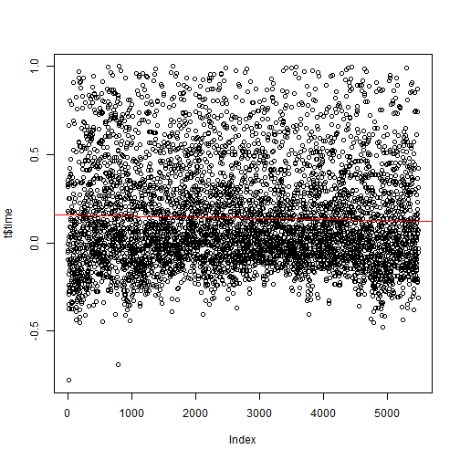
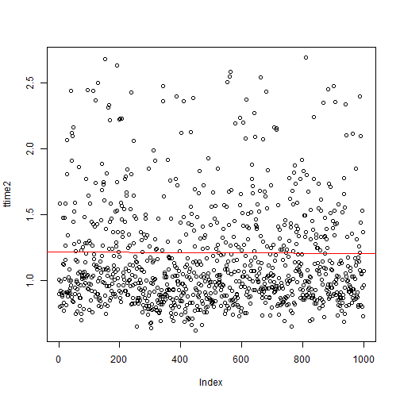

Reaction Time analysis
========================================================


## screening the datas

```r
library(ggplot2)
graphics.off()
t = read.csv2("../rawDatas/numbers.csv", sep = ";", colClasses = c("factor", 
    "factor", "numeric", "factor", "numeric", "factor"), dec = ".")
```

### no outlier filtering

```r
hist(t$time)
```

 

```r
var(t$time)
```

```
## [1] 4943
```

```r
mean(t$time)
```

```
## [1] 2.589
```

### first buggy outlier filtering and item by item analysis

```r
outlierFilter = t$time < 5
t = t[outlierFilter, ]
means.t = tapply(t$time, t$item, mean)
hist(means.t)
```

 

```r
vari = var(t$time)
mean = mean(t$time)
vari
```

```
## [1] 0.4779
```

```r
mean
```

```
## [1] 1.336
```

```r
outlierBound = mean + 2 * sqrt(vari)
outlierBound
```

```
## [1] 2.719
```

### outlier filtering and means item by item analysis

```r
outlierFilter1 = (t$time < outlierBound) & (t$time > 0.45)
t = t[outlierFilter1, ]
means.t = tapply(t$time, t$item, mean)
var.t = tapply(t$time, t$item, var)
hist(means.t)
```

 

```r
boxplot(means.t)
stripchart(means.t, vertical = TRUE, method = "jitter", pch = 21, col = "maroon", 
    bg = "bisque", add = TRUE)
```

 

```r
sort(means.t)
```

```
##     00     37     14     35     56     55     19     33     88     85 
## 0.9088 0.9408 0.9414 0.9613 0.9624 0.9637 0.9649 0.9677 0.9805 0.9957 
##     12     69     05     50     59     25     65     09     31     64 
## 0.9981 1.0022 1.0060 1.0259 1.0410 1.0515 1.0541 1.0593 1.0600 1.0605 
##     26     49     95     77     28     98     04     45     36     44 
## 1.0773 1.0812 1.0843 1.0898 1.0900 1.0977 1.1019 1.1065 1.1084 1.1190 
##     24     53     17     86     07     11     29     79     96     06 
## 1.1203 1.1251 1.1255 1.1260 1.1298 1.1306 1.1321 1.1326 1.1405 1.1411 
##     41     91     54     10     08     22     61     34     60     18 
## 1.1442 1.1453 1.1493 1.1526 1.1528 1.1573 1.1608 1.1699 1.1711 1.1718 
##     72     75     20     32     94     47     48     97     15     42 
## 1.1757 1.1759 1.1818 1.1819 1.1820 1.1888 1.1975 1.2050 1.2108 1.2111 
##     01     21     80     76     92     82     57     13     73     78 
## 1.2119 1.2123 1.2131 1.2153 1.2212 1.2213 1.2217 1.2265 1.2284 1.2291 
##     16     74     81     93     58     66     27     03     23     71 
## 1.2435 1.2450 1.2458 1.2560 1.2580 1.2683 1.2723 1.2857 1.2864 1.2981 
##     46     51     43     39     89     38     90     87     67     40 
## 1.3006 1.3139 1.3148 1.3156 1.3168 1.3213 1.3237 1.3304 1.3402 1.3476 
##     62     02     30     70     68     99     83     52     84     63 
## 1.3490 1.3555 1.3737 1.3768 1.3839 1.4108 1.4230 1.4356 1.4426 1.5039
```

#### small analysis : are doubles easier to react on ?

```r
doubles = c(0, 11, 22, 33, 44, 55, 66, 77, 88, 99)
Ldoubles = (t$item %in% doubles)
Lnotdoubles = !Ldoubles
t.doubles = t[Ldoubles, ]
t.notDoubles = t[Lnotdoubles, ]
mdoubles = tapply(t.doubles$time, t.doubles$item, mean)
mnotDoubles = tapply(t.notDoubles$time, t.notDoubles$item, mean)
t.test(mdoubles, mnotDoubles)
```

```
## 
## 	Welch Two Sample t-test
## 
## data:  mdoubles and mnotDoubles
## t = -1.234, df = 9.182, p-value = 0.248
## alternative hypothesis: true difference in means is not equal to 0
## 95 percent confidence interval:
##  -0.17860  0.05231
## sample estimates:
## mean of x mean of y 
##     1.121     1.184
```

Not anymore, 99 was forgoten in previous script
## unbiased mean reaction time of the last 1500 items

The script which comes from the datas makes harder item more frequent

```r
time1500 <- tail(t$time, n = 1500)
item1500 <- tail(t$item, n = 1500)
means.time1500 = tapply(time1500, item1500, mean)
sort(means.time1500)
```

```
##     05     35     00     19     55     37     14     59     33     12 
## 0.8321 0.8409 0.8483 0.8676 0.8774 0.8961 0.9071 0.9266 0.9335 0.9476 
##     28     69     94     17     88     25     09     56     53     50 
## 0.9499 0.9582 0.9651 0.9700 0.9724 0.9782 0.9795 0.9936 1.0038 1.0043 
##     26     54     49     11     31     42     47     98     64     45 
## 1.0055 1.0083 1.0158 1.0171 1.0191 1.0193 1.0296 1.0306 1.0331 1.0432 
##     85     36     20     32     43     82     91     29     06     04 
## 1.0478 1.0498 1.0528 1.0538 1.0572 1.0637 1.0637 1.0741 1.0760 1.0763 
##     92     95     22     96     93     41     16     71     66     08 
## 1.0794 1.0843 1.1055 1.1066 1.1077 1.1139 1.1182 1.1189 1.1216 1.1216 
##     24     60     01     65     21     81     13     80     10     86 
## 1.1221 1.1293 1.1322 1.1329 1.1412 1.1441 1.1488 1.1498 1.1514 1.1632 
##     74     79     75     77     44     48     34     89     73     18 
## 1.1717 1.1801 1.1833 1.1842 1.1909 1.2100 1.2186 1.2253 1.2261 1.2277 
##     03     97     51     57     02     38     78     23     72     46 
## 1.2328 1.2516 1.2553 1.2611 1.2625 1.2645 1.2648 1.2739 1.2778 1.2803 
##     90     30     15     61     07     83     87     52     58     63 
## 1.2992 1.3007 1.3037 1.3049 1.3051 1.3177 1.3314 1.3360 1.3488 1.3578 
##     39     68     70     76     62     99     27     84     40     67 
## 1.3619 1.3623 1.3635 1.3940 1.4015 1.4396 1.4500 1.4639 1.4688 1.5403
```

```r
mm = mean(means.time1500)
```

The unbiased mean reaction time across the last 1500 trials is evaluated at 1.1408
# predictions based on the whole dataset
## plot

```r
t$ind <- seq.int(nrow(t))
plot(t$time)
linearModel = lm(t$time ~ t$ind)
abline(linearModel, col = "red")
```

 

## predict

```r
intercept = coef(linearModel)["(Intercept)"]
slope = coef(linearModel)["t$ind"]
nbTrials = round((1 - intercept)/slope - tail(t$ind, n = 1), -2)
```

each time an item is viewed, the mean reaction time diminish of -9.934 &times; 10<sup>-6</sup>, not that much then :)   
At this rate 17700 new trials will be recquired to get a mean below 1s
# predictions based on the last 1000 trials
## plot

```r
tind2 <- tail(t$ind, n = 1000)
ttime2 <- tail(t$time, n = 1000)
plot(ttime2)
linearModel = lm(ttime2 ~ tind2)
abline(linearModel, col = "red")
```

 

## predict

```r
intercept = coef(linearModel)["(Intercept)"]
slope = coef(linearModel)["tind2"]
nbTrials = round((1 - intercept)/slope - tail(tind2, n = 1), -2)
days = round(((1 - intercept)/slope - tail(tind2, n = 1))/1000, 1)
```

each time an item is viewed, the mean reaction time diminish of -1.2037 &times; 10<sup>-5</sup>.
At this rate 12600 new trials will be recquired to get a mean below 1s. With 1000 trials by day, it will need 12.6 days. Maybe a more sharper training programm focused on weak element might allow a faster reach of the 1s threshold
